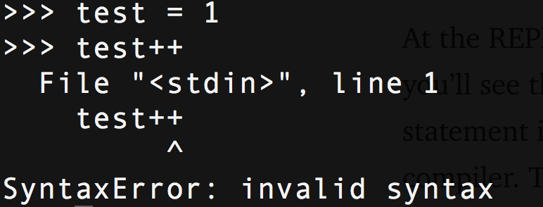
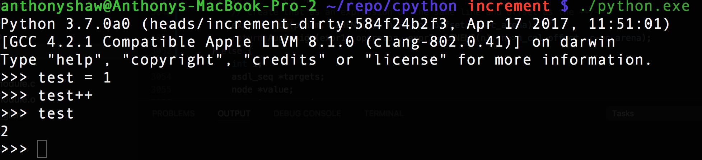
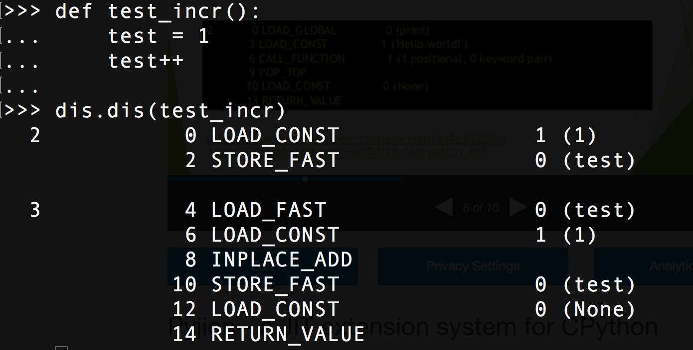

blog_heading: Modifying the Python language in 6 minutes
blog_subheading: Showing you how to hack the Python grammar and compiler
blog_header_image: posts/token-s2.png
blog_author: Anthony Shaw
blog_publish_date: April 17, 2017
---
This week I raised [my first pull-request](https://github.com/python/cpython/pull/1069) to the CPython core project, which was declined :-( but as to not completely waste my time I’m writing my findings on how CPython works and show you how easy it is to modify the Python syntax.
I’m going to show you how to add a new feature to the Python syntax. That syntax is the increment/decrement operator, a common operator in most languages. Just to prove, open up the REPL and try it.



## Level 1: PEPs

Before the Python syntax is changed, a proposal needs to be made with a set of reasons, design and behaviours. All language changes are discussed by the core Python team and approved by the BDFL. Increment operators are not approved (and probably never will be), which gives us a good test.

##Level 2: Grammar

The Grammar file is simple text file describing all the elements of the Python language. This is used by not just CPython, but other implementations like PyPy to keep consistency and agree on the types of language semantics.
Internally, these keys form the tokens, which are parsed by the lexer. When you `make -j` a command converts these into a set of enums and constants in the C headers. This allows us to reference them later on.

```default
stmt: simple_stmt | compound_stmt
simple_stmt: small_stmt (';' small_stmt)* [';'] NEWLINE
# ...
pass_stmt: 'pass'
flow_stmt: break_stmt | continue_stmt | return_stmt | raise_stmt | yield_stmt
break_stmt: 'break'
continue_stmt: 'continue'
# ..
import_as_name: NAME ['as' NAME]
```

So, a `simple_stmt` is a simple statement, it can optionally have a semicolon, like when you put `import pdb; pdb.set_trace()` and ends in a new line `NEWLINE`. A `pass_stmt` is the word pass, a `break_stmt` is the work break. Simple, right?
Let’s add an increment and decrement expression, something which does not exist in the language. It would be another option in an expression statement, along with yields, augmented assignment and regular assignment, i.e.foo=1.

```default
# Add increment and decrement to expression statement
expr_stmt: testlist_star_expr (annassign | augassign (yield_expr|testlist) |
                     ('=' (yield_expr|testlist_star_expr))* | incr_stmt | decr_stmt)
annassign: ':' test ['=' test]
testlist_star_expr: (test|star_expr) (',' (test|star_expr))* [',']
augassign: ('+=' | '-=' | '*=' | '@=' | '/=' | '%=' | '&=' | '|=' | '^=' |
            '<<=' | '>>=' | '**=' | '//=')
# For normal and annotated assignments, additional restrictions enforced by the interpreter
del_stmt: 'del' exprlist

# New statements
incr_stmt: '++'
decr_stmt: '--'
```

We add it to the possible list of small statements (this will become obvious in the AST). The `incr_stmt` will be our increment method and `decr_stmt` will be a decrement. Both follow a `NAME` (a variable name) and form a small standalone statement. When we build the Python project it will generate the components for us (not yet).
If you start Python with -d and try it you should get:

Token <ERRORTOKEN>/’++’ … Illegal token

What is a token? Let’s find out..

## Level 3 : Lexer

There are four steps that Python takes when you hit return: lexing, parsing, compiling, and interpreting. Lexing is breaking the line of code you just typed into tokens. The CPython lexer is called tokenizer.c. It has the functions that read from a file (like python file.py, a string (like the REPL). It also handles the special encoding comment at the top of files and parses your file as UTF-8, etc. It handles nesting, async and yield keywords, detects sets and tuple assignment, but only the grammar. It doesn’t know what those things are or what to do with them. It just cares about the text.
For example, the code that allows you to use the o notation for octal values is in the tokenizer. The code to actually create octal values is in the compiler.
Let’s add 2 things to `Parser/tokenizer.c`, the new INCREMENT and DECREMENT tokens, these are the keys that get returned by the tokenizer for each part of the code.

```c
/* Token names */

const char *_PyParser_TokenNames[] = {
    "ENDMARKER",
    "NAME",
    "NUMBER",
...
    "INCREMENT",
    "DECREMENT",
...
```

Then, we add check to return a `INCREMENT` or `DECREMENT` token, whenever we see ++ or — . There is already a function for 2 character operators, so we extend this to suit our case.

```c
@@ -1175,11 +1177,13 @@ PyToken_TwoChars(int c1, int c2)
         break;
     case '+':
         switch (c2) {
+        case '+':               return INCREMENT;
         case '=':               return PLUSEQUAL;
         }
         break;
     case '-':
         switch (c2) {
+        case '-':               return DECREMENT;
         case '=':               return MINEQUAL;
         case '>':               return RARROW;
         }
```

Those are defined in token.h

```default
#define INCREMENT 58
#define DECREMENT 59
```

Now, when we run Python with -d and try our statement we see:


It’s a token we know — Success!

## Level 4 : Parser

The parser takes those tokens and generates a structure that shows their relationship to each other. For Python and many other langauges, this is the Abstract Syntax Tree (or AST). The compiler then takes the AST and turns it into one (or more) code objects. Finally, the interpreter takes each code object executes the code it represents. Think of your code as a tree. The top level is the root, a function might be a branch, a class is a branch and the class methods branch off that. The statements are leaves within a branch.
The AST is defined in both ast.py and ast.c. ast.c is the file we need to change. The AST code is broken into methods that handle the types of tokens, ast_for_stmt handles statements, ast_for_expr handles expressions. We put the incr_stmtand decr_stmt as possible expression statements. They are almost identical to Augmented Expressions, e.g. test += 1 but there is no right-hand expression (1), it is implicit.
This is the code for us to add to handle increment and decrement.

```c
static stmt_ty
ast_for_expr_stmt(struct compiling *c, const node *n)
{
    ...
    else if ((TYPE(CHILD(n, 1)) == incr_stmt) || (TYPE(CHILD(n, 1)) == decr_stmt)) {
        expr_ty expr1, expr2;
        node *ch = CHILD(n, 0);
        operator_ty operator;
        
        switch (TYPE(CHILD(n, 1))){
            case incr_stmt:
                operator = Add; 
                break;
            case decr_stmt:
                operator = Subtract; 
                break;
        }

        expr1 = ast_for_testlist(c, ch);
        if (!expr1) {
            return NULL;
        }
        switch (expr1->kind) {
            case Name_kind:
                if (forbidden_name(c, expr1->v.Name.id, n, 0)) {
                    return NULL;
                }
                expr1->v.Name.ctx = Store;
                break;
            default:
                ast_error(c, ch,
                          "illegal target for increment/decrement");
                return NULL;
        }
        // Create a PyObject for the number 1
        PyObject *pynum = parsenumber(c, "1");

        if (PyArena_AddPyObject(c->c_arena, pynum) < 0) {
            Py_DECREF(pynum);
            return NULL;
        }
        // Create that as an expression on the same line and offset as the ++/--
        expr2 = Num(pynum, LINENO(n), n->n_col_offset, c->c_arena);
        return AugAssign(expr1, operator, expr2, LINENO(n), n->n_col_offset, c->c_arena);
```

This returns an Augmented Assignment — instead of a new Expression type with a constant value of 1. The operator is either Add or Sub(tract) depending on the token type incr_stmt or decr_stmt. Going back into the Python REPL after compiling — we can see our new statement!



At the REPL, you can try this : ast.parse("test=1; test++).body[1] and you’ll see the AugAssign type returned. The AST has just converted the statement into a statement expression which can then be handled by the compiler. The AugAssign function sets the field Kind which is used by the compiler.

## Level 5: Compiler

The compiler then takes the syntax tree and ‘visits’ each branch, the CPython compiler has a method for visiting a statement, called compile_visit_stmt which is just a big switch statement looking at the statement kind. Our’s was a AugAssign type, so it calls out to compiler_augassign to handle the details. This function then converts our statement into a set of Byte-codes. These are an intermediary language between machine code (01010101) and the syntax tree. The Byte-code sequence is the thing cached in .pyc files.

```c
static int
compiler_augassign(struct compiler *c, stmt_ty s)
{
    expr_ty e = s->v.AugAssign.target;
    expr_ty auge;

    assert(s->kind == AugAssign_kind);

    switch (e->kind) {
...
    case Name_kind:
        if (!compiler_nameop(c, e->v.Name.id, Load))
            return 0;
        VISIT(c, expr, s->v.AugAssign.value);
        ADDOP(c, inplace_binop(c, s->v.AugAssign.op));
        return compiler_nameop(c, e->v.Name.id, Store);
```

The output would be VISIT (load value — which is 1 for us), ADDOP (add operation of a binary op, depending on the operator (subtract, add), and STORE_NAME (store the result of ADDOP to the Name). Those methods respond with more specific byte-codes.
If you load the dis module you can see the byte-code for yourself



## Level 6: Interpreter

The final level is the interpreter. That takes the byte-code sequence and converts it into machine-specific operations. This is why Python.exe and Python for mac and Linux are all seperate binaries. Some byte codes need OS specific handling and checks. The threading API for example needs to work with GNU/Linux’s thread API which is very different to Windows threading.
That’s it!

## Further Reading

If you’re interested in interpreters, I’ve given a talk on Pyjion, a plugin architecture for CPython which became PEP523

If you still want to play, I pushed the code up to GitHub, along with my changes to the await tokenizer.

[See also my article on realpython.com giving a full breakdown of the Python compiler](https://realpython.com/cpython-source-code-guide/)